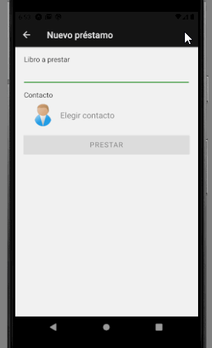

# Nuevo préstamo

## Nuestro objetivo

Definir la pantalla que permita cargar un nuevo préstamo.

## Pasos

* seleccionar el libro que uno está prestando, mediante una búsqueda rápida que muestra las opciones a medida que va escribiendo
* seleccionar el contacto 
* la fecha se asume la del día de hoy
* agregar el préstamo en la lista y cerrar la pantalla

## Pantalla

Definimos una pantalla donde

* utilizamos un `Pressable` como contenedor en vez de un `View` para poder esconder el teclado al presionar una parte de la pantalla vacia
* un `TextInput` y un `FlatList` para mostrarle al usuario las opciones de libros que puede seleccionar
* para mostrar los datos del contacto en una sola línea, creamos un componente `ContactoItem`. En este componente está compuesto de
    * un `Image` que muestre la foto del contacto
    * varios `Text` que muestran la información del contacto: esto puede ser sólo nombre o podría incluir teléfono y email
    * un `View` para separar la imagen y el texto en dos columnas
    * un `Pressable` que dispare la app búsqueda de contactos del dispositivo
    * si no tenemos un contacto seleccionado, utilizamos uno con una imagen y texto por defecto
* un `Pressable` que dispare la acción que crear el nuevo préstamo


### Búsqueda con Autocomplete

En el `componentDidMount` de la pantalla obtenemos la lista de libros pendientes:

```tsx
async componentDidMount(): Promise<void> {
    const libros = await repoLibros.librosPrestables()
    this.setState({ libros })
}
```

Podemos capturar el evento `onChangeText` del `TextInput` para guardar el valor ingresado y hacer la búsqueda en la lista de libros en base a este:

```tsx
filtrarLibros = (): Libro[] => {
    const { libros, busqueda } = this.state
    const fuse = new Fuse(libros, {
        keys: [
            "titulo",
            "autor"
        ]
    })
    return fuse.search(busqueda).map(e => e.item)
}
```

> Para el ejemplo uso la libreria [fuse.js](https://fusejs.io/) que me permite hacer una busqueda difusa (coincidencia aproximada de textos).

Al seleccionar un elemento de la lista se borrara la búsqueda y se mostrará el título del libro seleccionado en el input, en el caso de que no se seleccione ninguno, se borrara el input y la variable `libroSeleccionado` quedará en `undefined`.

### Búsqueda de contactos

Al hacer click en el botón se navegara a la pantalla de búsqueda de contacto

```tsx
buscarContacto = (): void => {
    const { navigation } = this.props
    navigation.navigate('ElegirContacto', { seleccionarContacto: this.seleccionarContacto })
}
```

> Al ejecutar este método vemos que React Navigation nos muestra un warning porque le estamos pasando una función y esta no es serializable. Se recomienda usar un contexto o redux. 

Una vez que seleccionamos un contacto, hay que capturar el evento como callback:

```tsx
seleccionarContacto = (contacto: Contacto): void => this.setState({ contactoSeleccionado: contacto })
```
### Prestar

Al prestar hay que instanciar un préstamo con 

* el libro seleccionado, que lo tenemos en una variable de estado `libroSeleccionado` (se carga en el método `onPress` del `Pressable` en `renderLibro`)
* el contacto seleccionado, que lo tenemos también en una variable de estado `contactoSeleccionado` (se carga en el método `seleccionarContacto`)

luego delegar al repositorio y cerrar la pantalla.

```tsx
nuevoPrestamo = (): void => {
    const { navigation } = this.props
    const { libroSeleccionado, contactoSeleccionado } = this.state
    if (libroSeleccionado && contactoSeleccionado) {
        const nuevoPrestamo = new Prestamo(0, contactoSeleccionado, libroSeleccionado)
        nuevoPrestamo.prestar()
        repoPrestamos.addPrestamo(nuevoPrestamo)
        navigation.goBack()
    }
}
```

Por último hay que indicar a la pantalla principal que refresque la lista de préstamos al volver:

```tsx
unsubscribeNavigationFocus!:() => void

componentDidMount(): void {
    ...
     this.unsubscribeNavigationFocus = navigation.addListener('focus', this.cargarPrestamos)
}

componentWillUnmount() {
    this.unsubscribeNavigationFocus()
}
```

## Ejecutando la aplicación

Vemos cómo queda el resultado final.

